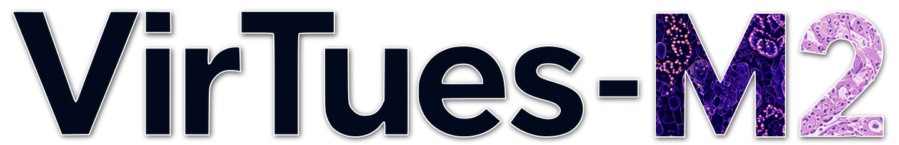
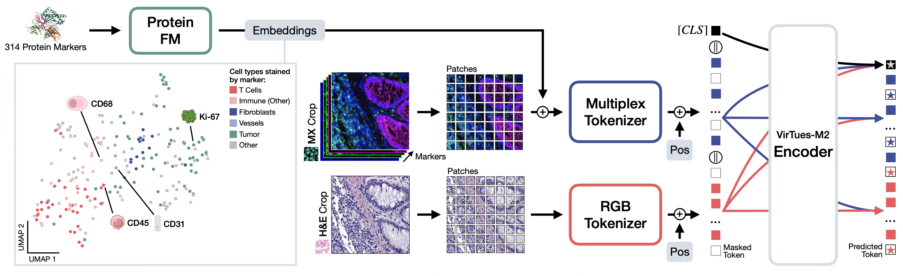

# VirTues-M2: A multimodal foundation model for tissue proteomics and morpholoy in cancer

*[[Preprint]]() | [[Model Weights]](https://huggingface.co/bunnelab/virtues-m2) | [[Cite]](#reference)*



*Authors:* Benedikt von Querfurth*, Lukas Klein*, Cédric Vincent-Cuaz, Eeshaan Jain, Yexiang Cheng, Johann Wenckstern, Phil F. Cheng, Petros Liakopoulos, Olivier Michielin, Martina Haberecker, Andreas Wicki, Pascal Frossard, Charlotte Bunne

*Abstract:* Cancer diagnosis, prognosis, and treatment decisions increasingly rely on integrating tissue morphology with specific molecular readouts of the tumor and its microenvironment. H&E histopathology provides scalable morphology, whereas multiplex spatial proteomics quantifies dozens of proteins _in situ_ with spatial context, but remains selectively deployed, often with different marker panels across cohorts. This creates a translational bottleneck: most patients lack high-depth molecular profiling, and existing models rarely integrate morphology and spatial molecular data in a single framework. We present VirTues-M2, a multimodal foundation model that jointly learns from H&E and spatial proteomics using a novel vision transformer-based architecture. By encoding marker identity during pretraining, VirTues-M2 is robust to missing modalities, imperfect pairing or registration, and variable marker panels, enabling unified inference for tissue phenotyping, panoptic cell segmentation, virtual staining, annotation-free biomarker discovery, and reinforcement learning-based adaptive marker panel selection to reduce assay burden. <br>
As a concrete demonstration of translational utility, in a newly collected cohort of 1,053 treatment-naive non-small-cell lung cancer (NSCLC) patients with paired spatial proteomics and H&E, VirTues-M2 discovers high-risk and low-risk tissue signatures that stratify overall survival in both the discovery cohort and an independent validation cohort, outperforming current state-of-the-art stratification schemes, enabled by VirTues-M2’s ability to jointly analyze both modalities within a single model. 

<br>
<p align='center'>

</p>

## Installation
To install all dependencies needed to run VirTues-M2, download the repository first:

```
git clone https://github.com/bunnelab/virtues-m2.git
cd virtues-m2
```

Then, create an environment and activate it:

```
conda create --name virtuesm2 python=3.11
conda activate virtuesm2
```

Afterwards, install all requirements:
```
pip install -e .
```

## Training
*Pretraining, virtual staining and cell phenotyping & segmentation code will be added soon!*

## Inference
### Datasets
VirTues-M2 training and evaluation datasets will be made public in spora. You can follow the download instructions on the spora [project page](https://spora.epfl.ch) and use the notebooks spora enabled notebooks. This is the **recommended** way of using VirTues-M2. If you do not want to download a spora dataset or do not want to convert your dataset into the spora[data] format, you can refer to the notebooks non-spora notebooks.

### Model weights
The model weights for the VirTues-M2 backbone, segmentation and virtual staining head are all available on [HuggingFace](https://huggingface.co/bunnelab/virtues-m2) and currently reside in the `v2` branch. The model backbone can be instantiated as follows:
```python
from virtuesm2.models.virtuesm2_hf import VirTuesM2_HF
model = VirTuesM2_HF.from_pretrained("bunnelab/virtues-m2", marker_embedding_dir="example_data/esm_embeddings", force_download=True, revision="v2")
```

### Tutorial Notebooks

We provide three inference notebooks in the `notebooks` folder to show how to embed multi- and uni-modal images with VirTues-M2 and potential downstream tasks that leverage the frozen VirTues-M2 encoding abilities.
In the notebook [`1_inference_PCAs.ipynb`](notebooks/1_inference_PCAs.ipynb), simple PCAs are shown, whereas in [`2_cell_segmentation_spora.ipynb`](notebooks/2_cell_segmentation_spora.ipynb) we demonstrate panoptic cell segmentation based on VirTues-M2 for joint cell phenotyping and cell instance segmentation in a single forward pass.
The notebook [`3_virtual_staining_spora.ipynb`](notebooks/3_virtual_staining_spora.ipynb) demonstrates how to perform virtual staining on a subset of 11 markers. Support for more markers will come soon!

### Models
| Model Name | Training Data |  License of Model Weights | HuggingFace Branch | Segmentation Head | Virtual Staining Head |
| --- | --- | --- | --- | --- | --- |
| `virtues-m2-sp37` | 37 partially multimodal spatial proteomics datasets | CC BY-NC 4.0 | `v2` |  ✔ | ✔ |

## License and Terms of Use

Copyright (c) ECOLE POLYTECHNIQUE FEDERALE DE LAUSANNE, Switzerland,
Laboratory of Artificial Intelligence in Molecular Medicine, 2026

This repository and related code are released under the MIT License. See `LICENSE.md` for details.

## Reference
If you find our work useful in your research or if you use parts of this code please consider citing our [paper]():

```
@article{...,
  title = {},
  author = {},
  journal = {},
  publisher = {},
  year = {}
}
```