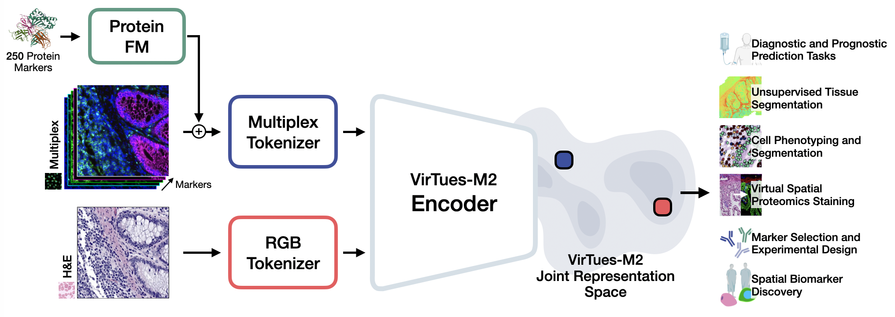

<p align="center">
  
</p>

# A multimodal foundation model for tissue proteomics and morphology in cancer

*🤗 [[Model Weights]](https://huggingface.co/bunnelab/virtues-m2) | [[Cite]](#reference)*

VirTues-M2 is a foundation model for tissue biology that jointly learns from routine H&E histopathology and multiplex spatial proteomics within a single architecture. It follows an early-fusion design: pixel-aligned images are embedded by modality-specific tokenizers (an RGB tokenizer for H&E and a multiplex tokenizer for spatial proteomics) and processed by a shared vision transformer backbone. In the multiplex tokenizer, each channel is combined with a protein foundation model embedding of its marker identity. This lets VirTues-M2 handle arbitrary and varying marker panels and stay robust to missing modalities, incomplete pairing and imperfect alignment. VirTues-M2 is pretrained on the largest open-source multiplex spatial proteomics collection with partially paired H&E, covering 5,849 patients, 37 studies and 17,275 multiplex tissues acquired with PhenoCycler (CODEX), Orion, IMC and MIBI. The resulting joint representation can be used in tasks such as treatment response, tissue phenotyping, panoptic cell segmentation, virtual staining, biomarker discovery and adaptive marker panel selection.

<p align="center">
  
</p>

## Installation
To install all dependencies needed to run VirTues-M2, download the repository first:

```
git clone https://github.com/bunnelab/virtues-m2.git
cd virtues-m2
```

Then, create an environment and activate it:

```
conda create --name virtuesm2 python=3.11
conda activate virtuesm2
```

Afterwards, install all requirements:
```
pip install -e .
```

## Inference

### Marker embeddings

To encode the antibody markers of the spatial proteomics images, we use the ESM-2 protein language model to encode the corresponding proteins. Instructions for generating these embeddings can be found in the VirTues GitHub repository, [here](https://github.com/bunnelab/virtues#marker-embeddings).

### Model weights
The model weights for the VirTues-M2 backbone, segmentation and virtual staining head are all available on [HuggingFace](https://huggingface.co/bunnelab/virtues-m2) and currently reside in the `v2` branch. The model backbone can be instantiated as follows:
```python
from virtuesm2.models.virtuesm2_hf import VirTuesM2_HF
model = VirTuesM2_HF.from_pretrained("bunnelab/virtues-m2", marker_embedding_dir="example_data/esm_embeddings", force_download=True, revision="v2")
```

### Tutorial Notebooks

We provide three inference notebooks in the `notebooks` folder to show how to embed multi- and uni-modal images with VirTues-M2 and potential downstream tasks that leverage the frozen VirTues-M2 encoding abilities.
In the notebook [`1_inference_PCAs.ipynb`](notebooks/1_inference_PCAs.ipynb), simple PCAs are shown, whereas in [`2_cell_segmentation.ipynb`](notebooks/2_cell_segmentation.ipynb) we demonstrate panoptic cell segmentation based on VirTues-M2 for joint cell phenotyping and cell instance segmentation in a single forward pass.
The notebook [`3_virtual_staining.ipynb`](notebooks/3_virtual_staining.ipynb) demonstrates how to perform virtual staining on a subset of 11 markers.

### Models
| Model Name | Training Data |  License of Model Weights | HuggingFace Branch | Segmentation Head | Virtual Staining Head |
| --- | --- | --- | --- | --- | --- |
| `virtues-m2-sp37` | 37 partially multimodal spatial proteomics datasets | CC BY-NC 4.0 | `v2` |  ✔ | ✔ |

## License and Terms of Use

Copyright (c) ECOLE POLYTECHNIQUE FEDERALE DE LAUSANNE, Switzerland,
Laboratory of Artificial Intelligence in Molecular Medicine, 2026

This repository and related code are released under the MIT License. See `LICENSE.md` for details.

## Reference
If you find our work useful in your research or if you use parts of this code please consider citing our [paper]():

```
@article{...,
  title = {},
  author = {},
  journal = {},
  publisher = {},
  year = {}
}
```
